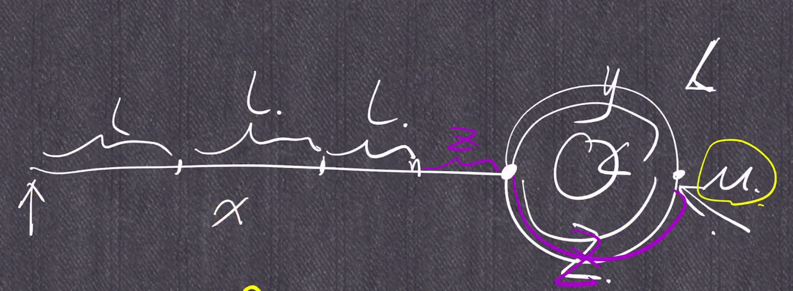

# 287. Find the Duplicate Number

## Analysis

1. Refer to [645](../easy/untitled-2.md).

2. Slow and fast pointer, circle detection in a linked list



slow: x + y  \(slow is bound to be caught by fast within one circle\)

fast: 2\(x+y\) = x + y + k\*L -&gt; x = \(k-1\)\*L + L - y -&gt; x = \(k-1\)\*L + z -&gt; x mod L = z  \(k has to larger than 1\)

3. For code, **slow = nums\[slow\]** rather than **nums\[slow-1\]** is to avoid self-pointing or self-circle when the current node points to itself. E.g. \[1, 2, 3, 2, 5\]


### C++ 

```cpp
class Solution {
public:
    int findDuplicate(vector<int>& nums) {
        int length = nums.size();
        
        for(int i = 0; i < length; i++){
            if (nums[abs(nums[i])-1] < 0) return abs(nums[i]);
            else nums[abs(nums[i])-1] = -nums[abs(nums[i])-1];
        }
        
        return 0;
    }
};


class Solution {
public:
    int findDuplicate(vector<int>& nums) {
        int slow = 0, fast = 0;
        
        do{
            slow = nums[slow];
            fast = nums[nums[fast]];
        }while(slow != fast);
        
        slow = 0;
        do{
            slow = nums[slow];
            fast = nums[fast];
        }while(slow != fast);
        
        return slow;
    }
};  
```

